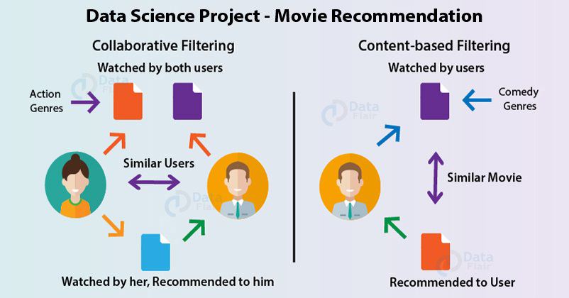

# Movie Recommendation

Dataset taken from : https://grouplens.org/datasets/movielens/latest/

Dataset (small version) contains 100836 ratings and 3683 tag applications across 9742 movies. These data were created by 610 users between March 29, 1996 and September 24, 2018.

Objective
-

Recommendation systems skim through all possible options and create a customized list of items that are interesting and relevant to an individual. Here we will apply several Recommendation techniques to recommend movies to users based on user/item similarity.

Concepts
-

**Content-based Filtering:** Recommends movies based on a user's past seen movies, ratings and reviews.

**Collaborative Filtering:** Matches customers who watched similar movies.

**User based collaborative filtering:** This algorithm first finds the similarity score between users. Based on this similarity score, it then picks out the most similar users and recommends movies which these similar users have seen previously.

**Item based collaborative filtering:** It looks for movies that are similar to the movies that user has already rated and recommend most similar movies.

EDA
-

- Movie Types distribution
- 5 star rated movies
- Most rated movies
- Users with most number of rating
- Avg rating and num of rating for each movie
- Weighted score of each movie

Below graph show genre type based distribution of movies:

Top 10 movies based on weighted score:

Workings
-

- Genre based Movie Recommendation
- Recommending Movies using Pearson Correlation
- Recommending Movies using Cosine Similarity
- Recommending Movies using KNN (with Cosine distance metric)
- Clustering of movies (using KMeans)
- Recommending Movies using Content & Collaborative latent matrix with TFIDF & SVD
- Predicting unseen Movie ratings for user using Surprise Library (with SVD, KNN, NMF)
- Recommending Movies for a user using Surprise Library (with KNN)

Showing top 10 recommended movies using Content & Collaborative latent matrix:

